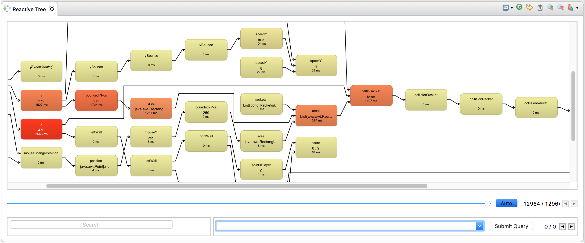

<link href="plugins/lightbox/css/lightbox.css" rel="stylesheet">
<script src="scripts/jquery.js"></script>
<script src="plugins/lightbox/js/lightbox.js"></script>

## Why Reactive Inspector?
Debugging reactive software with a traditional debugger can be unnecessary complicated. We want to change that. With the Reactive Inspector plugin we give you the tools needed to debug your reactive software in a comfortable and powerful way.

## Features
#### Reactive Tree
The reactive tree view lets you inspect variables, signals, events and their dependencies in a visualization of the dependency graph in your app. You can see the values of the individual nodes as they change over time and the tree provides you with visual cues when a significant event occurs, such as a value change or when an exception is thrown.



#### Tree Outline
In a big dependency graph it is sometimes hard to navigate in the reactive tree. This view shows you at a glance where you are in the graph and helps you jump quickly to a different portion of the graph.



#### Time Travel
Ever needed to go back to a particular step in your program to inspect your variables values at that point in time? Well, Reactive Inspector makes this possible. It records all the values of each signal or variable and allows you to travel back in time through all states of the dependency graph.
This video shows you how it works in action.

<video src=images/time-travel.mp4 controls> 
   Your browser does not implement html5 video. 
</video>

#### History Queries
Scrubbing through past values is useful, but it can become cumbersome if you have a big dependency graph. With History Queries you can search in the history for specific reactive events.

<a id="history-queries" class="anchor" href="#history-queries" aria-hidden="true"><span aria-hidden="true" class="octicon octicon-link"></span></a>History Queries</h4>

#### Reactive Breakpoints
One of the most helpful features  in finding those little bugs that hide between the lines of your code is Reactive Breakpoints.  With Reactive Breakpoints we give you the possibiliy to set breakpoints at certain reactive events. Create queries, such as ```nodeEvaluated```, and the debugger will pause if an event matches the query during the execution.
Go right to the place were the program was interrupted and find the bug that you were searching for so long.


#### Time Profiling
To improve the performance of your programs you have the possibility to measure the time needed to evaluate your reactive nodes. Reactive Inspector visualizes these measurements by coloring nodes in the tree view according to how each node performed in comparison to the others.  You can switch between 3 modes of time profiling:

* Relative Performance - shows the number of evaluations of each node
* Absolute Performance (latest) - shows the duration of the last evaluation
* Absolute Performance (sum) - shows the sum of the evaluation times of the nodes



#### Node Search / Dependency Highlighting
Reactive Inspector allows you to find nodes by their names. This makes navigation in dependancy graphs more comfortable.

You can also highlight a node and all of its dependencies. This allows you to find the dependencies and  of a selected node much easier.




## Supported Platforms
* IDE: Eclipse
* Language: Scala v. 2.4.1 and later
* RP Frameworks: [REScala](https://github.com/guidosalva/REScala)

## Installation & Setup
* Install and open Eclipse (the Scala IDE is recommended).
* Help -> Install New Software...
* Add the REclipse update site: https://dl.bintray.com/m1c3/generic
* Select the just added REclipse update site from the drow-down.
* Install the REclipse plugin from the Reactive Programming category.

#### Create a new project
If you want to create a new project with REclipse support you can use the Reactive Inspector template project contained in this repository as a starting point.

You can import the project into Eclipse via sbt:

* `sbt eclipse`
* Eclipse: File -> Import...
* Select General -> Existing Projects into Workspace
* Select the cloned template project.

#### Use an existing REScala project with REclipse

Add the REScala Logger to the dependencies of the build.sbt:
`"de.tuda.stg.reclipse" %% "rescala-logger" % "0.1"`

Add a resolver for the REclipse maven repository in the build.sbt:
`resolvers += Resolver.bintrayRepo("m1c3", "maven")`

Attach the REScala Logger to REScala's logging in the main method of your application (or at a place before any Var, Signal or Event is created):
```
rescala.ReactiveEngine.log = new REScalaLogger
```

## License
?

## Contributors
* [Matthias Jahn](https://github.com/m1c3)
* [Guido Salvaneshi](https://github.com/guidosalva)
* [Sebastian Ruhleder](https://github.com/ruhleder)
* [Kai Engelhardt](https://github.com/kaiengelhardt)
* [Konstantin Sitnikov](https://github.com/KonstantinSitnikov)