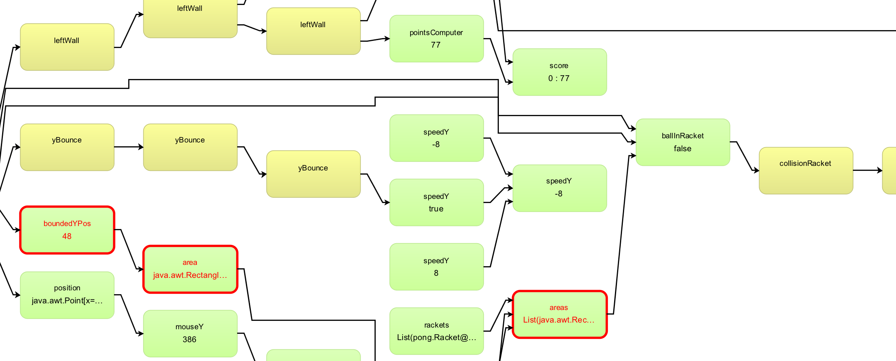
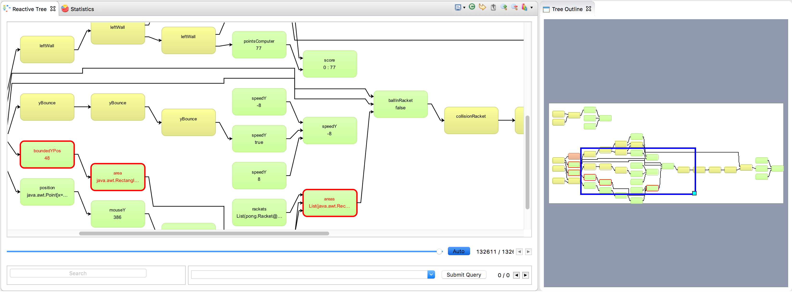
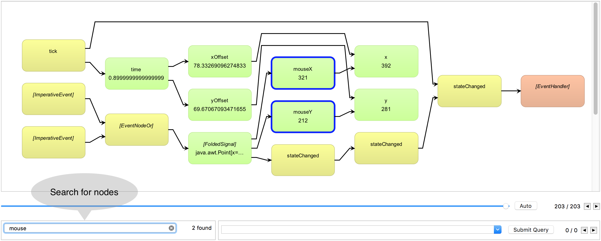

## Why REclipse?
Debugging reactive software with a traditional debugger can be unnecessary complicated. We want to change that. With the REclipse plugin we give you the tools needed to debug your reactive software in a comfortable and powerful way.

## Features
#### Reactive Tree
The reactive tree view lets you inspect variables, signals, events and their dependencies in a visualization of the dependency graph in your app. You can see the values of the individual nodes as they change over time and the tree provides you with visual cues when a significant event occurs, such as a value change or when an exception is thrown.




#### Tree Outline
In a big dependency graph it is sometimes hard to navigate in the reactive tree. This view shows you at a glance where you are in the graph and helps you jump quickly to a different portion of the graph.



#### Time Travel
Ever needed to go back to a particular step in your program to inspect your variables values at that point in time? Well, REclipse makes this possible. It records all the values of each signal or variable and allows you to travel back in time through all states of the dependency graph.
This video shows you how it works in action.

<video src=images/time-travel.mp4 controls> 
   Your browser does not implement html5 video. 
</ video>

History Queries

#### Reactive Breakpoints


#### Time Profiling


#### Node Search / Dependency Highlighting



## Supported Platforms
* IDE: Eclipse
* Language: Scala v. 2.4.1 and later
* RP Frameworks: [REScala](https://github.com/guidosalva/REScala)

## Installation & Setup
* Install and open Eclipse (the Scala IDE is recommended).
* Help -> Install New Software...
* Add the REclipse update site: https://dl.bintray.com/m1c3/generic
* Select the just added REclipse update site from the drow-down.
* Install the REclipse plugin from the Reactive Programming category.

#### Create a new project

If you want to create a new project with REclipse support you can use the [REclipse Template](https://github.com/m1c3/reclipse-template) project as a starting point:

`git clone https://github.com/m1c3/reclipse-template.git`

Then you can import the project into Eclipse via sbt:

* `sbt eclipse`
* Eclipse: File -> Import...
* Select General -> Existing Projects into Workspace
* Select the cloned template project.

#### Use an existing REScala project with REclipse

Add the REScala Logger to the dependencies of the build.sbt:
`"de.tuda.stg.reclipse" %% "rescala-logger" % "0.1"`

Add a resolver for the REclipse maven repository in the build.sbt:
`resolvers += Resolver.bintrayRepo("m1c3", "maven")`

Attach the REScala Logger to REScala's logging in the main method of your application (or at a place before any Var, Signal or Event is created):
```
rescala.ReactiveEngine.log = new REScalaLogger
```

## License
?

## Contributors
* [Matthias Jahn](https://github.com/m1c3)
* [Guido Salvaneshi](https://github.com/guidosalva)
* [Sebastian Ruhleder](https://github.com/ruhleder)
* [Kai Engelhardt](https://github.com/kaiengelhardt)
* [Konstantin Sitnikov](https://github.com/KonstantinSitnikov)